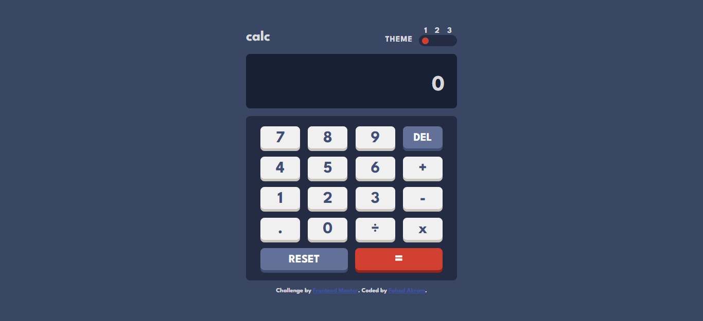
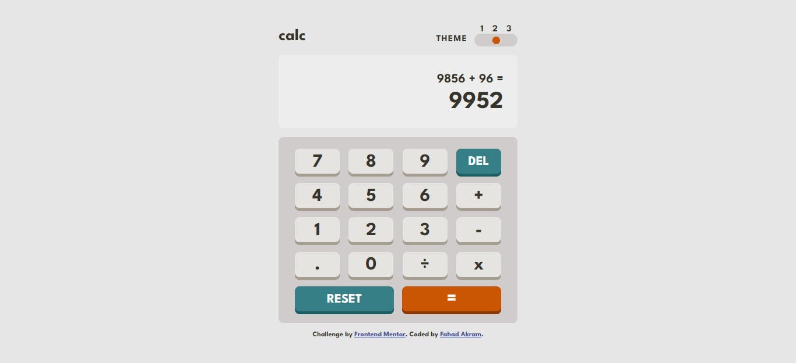
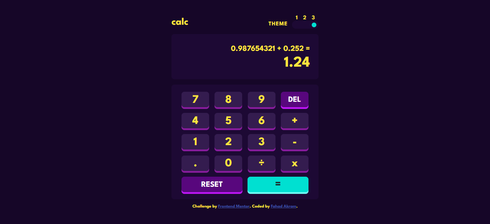

# Frontend Mentor - Calculator app solution

This is a solution to the [Calculator app challenge on Frontend Mentor](https://www.frontendmentor.io/challenges/calculator-app-9lteq5N29). Frontend Mentor challenges help you improve your coding skills by building realistic projects. 

## Table of contents

- [Overview](#overview)
  - [The challenge](#the-challenge)
  - [Screenshot](#screenshot)
  - [Links](#links)
- [My process](#my-process)
  - [Built with](#built-with)
  - [What I learned](#what-i-learned)
- [Author](#author)

## Overview

### The challenge

Users should be able to:

- See the size of the elements adjust based on their device's screen size
- Perform mathmatical operations like addition, subtraction, multiplication, and division
- Adjust the color theme based on their preference
- Have their initial theme preference checked and have any additional changes saved in the browser
- Use keyboard to enter values and perform operations

### Screenshot

### Links

- Solution URL: (https://github.com/FaDiiiLeo/calculator)
- Live Site URL: (https://fadiiileo.github.io/calculator/)

## My process

### Built with

- Semantic HTML5 markup
- CSS custom properties
- Flexbox
- Mobile-first workflow
- CSS preprocessor (Sass)
- CSS media queries
- ES6 Javascript

### What I learned

- Got familiarized with alot of concepts of Sass as this was my first project working with Sass
- Learned how to change themes and use Web Storage API to change the theme to last selected theme
- Learned how to use events like 'onclick' and 'onkeydown'

## Author

- Frontend Mentor - [@FaDiiiLeo](https://www.frontendmentor.io/profile/FaDiiiLeo)
- LinkedIn - [Fahad Akram](https://www.linkedin.com/in/fahad-akram-88bb9222b/)
- Stack Overflow - [Fahad](https://stackoverflow.com/users/12165302/fahad)
